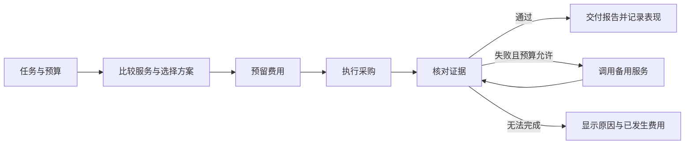

# AgentCo 产品说明

整理日期：2026-09-20。本文是实施前的范围提案；功能描述均为计划，不代表已实现。

## 产品是什么

AgentCo 是一个替用户采购 AI 服务的工作台。用户提出一个具体任务，设定最高采购预算和质量要求，AgentCo 比较可用服务、分配费用、执行调用、检查结果，并解释每项决策。

可以把它想成一家小型公司的采购经理、财务和质检员：采购经理选供应商，财务控制开销，质检员确认交付符合要求。服务越用越多，AgentCo 越能根据自己测量的记录判断哪些供应商适合哪类任务。

初期用户是需要链上研究结果的个人、开发者或其他 Agent。产品价值是让用户同时看清采购依据、实际开销和交付证据。

本轮以用户分享的 AgentCo MVP 讨论为产品输入。用户消息提到的另一份“复制文本”未随消息附上，尚未纳入。

## 活动信息

- 活动页当前显示报名关闭；线上开发期为 9 月 17–25 日，线下决赛为 10 月 7 日。团队是否已获接纳尚未确认。[活动页](https://luma.com/l4aq8vii)
- 建议主赛道为 **Build a Company**。该赛道要求通过 OKX AI 发布或集成可工作的服务，并演示完整流程；提交时提供相关服务或集成链接。
- 提交截止为 **2026-09-25 23:59 UTC**，换算新加坡/北京时间是 **2026-09-26 07:59**。材料包括项目说明、评审可访问的代码仓库、2–4 分钟演示视频，以及可用的产品链接。视觉原型需要进一步连接真实集成才能作为完整参赛交付。[Builder Kit](https://www.okx.com/en-sg/learn/okx-dev-day-builder-kit)

## 首版只完成一个场景

**Verified Token Risk Snapshot：有证据支持的代币风险快照。**

用户选择链与代币地址，输入采购预算、交付时限和策略。AgentCo 从小型服务目录中选择合适的风险分析服务，用独立数据核对关键事实，然后交付一份简明报告。

报告的验证范围是明确的：代币身份、必要字段、数据时间、流动性和持仓集中度等可核对信息。通过这些检查不等于证明代币安全，也不构成全面审计。界面应逐项显示哪些已验证、哪些缺少证据。

备用调用次数有明确上限；首版最多一次，不能形成无限重试。

## 一次采购如何运作

以下金额与服务表现仅为解释产品的演示假设，不是当前市场报价；示例暂不计额外模型、平台或网络费用。真实接入必须把适用费用计入预算上限，或明确列出独立限额。

用户给出 **0.50 USDT 采购预算**，选择 Balanced：

1. AgentCo 比较三家能力符合要求的服务，综合价格、已观测表现、样本量和时限选择方案。
2. 主服务计划花费 0.20，验证计划花费 0.02；备用服务 0.20，备用结果再次验证 0.02。
3. 最坏路径需要 0.44，因此执行前预留 0.44，未占用预算为 0.06。
4. 主服务与验证顺利完成，实际支出为 0.22。
5. 释放未使用的 0.22 预留，最终还有 0.28 预算未花。释放预算预留不等于发生链上退款。
6. 报告说明为何选中该服务、哪些证据通过验证、用了多少钱，并记录本次表现。

预算必须按最坏允许路径约束。预计成本可以用于比较方案，不能代替支出上限检查。

## 三种策略

| 策略 | 用户含义 | 计划中的选择方式 |
| --- | --- | --- |
| Lowest cost | 优先节省费用 | 在满足最低能力和交付要求的服务中控制成本；显示较少的验证覆盖 |
| Balanced | 兼顾费用与证据 | 主服务加独立验证，预算足够时预留备用方案 |
| High assurance | 更重视证据一致性 | 尽可能购买多个来源的意见并交叉验证；费用不足时明确提示无法执行 |

提高策略等级不保证结果正确。它代表更高的验证覆盖和更严格的执行条件。

选择依据应由可解释的程序规则计算。语言模型可用于理解输入和组织报告；金额、预算、候选过滤和执行权限由明确逻辑控制。

## AgentCo 与 OKX 的分工

| 部分 | 作用 |
| --- | --- |
| AgentCo | 服务筛选、预算规划、策略解释、验收、备用流程、实际表现记录和界面 |
| OKX AI | 服务市场与服务身份；首版使用经过核实的小型服务目录 |
| A2MCP / x402 | 标准化服务的按次调用与付费流程 |
| Agentic Wallet | 真实调用时的支付签署与钱包能力 |
| 独立数据源 | 为报告中的具体事实提供可比较的证据 |

[A2MCP 文档](https://web3.okx.com/onchainos/dev-docs/okxai/howtomcp)描述了免费接口和 x402 按次付费接口；[Agentic Wallet 文档](https://web3.okx.com/onchainos/dev-docs/home/agentic-wallet-overview)描述了 x402 支付支持。具体接口、币种、网络和费用必须在接入时核实。

未来可以把 AgentCo 本身包装成对外收费的 A2A 服务，向客户交付报告，再购买下游服务完成任务。按[当前 A2A 流程](https://web3.okx.com/onchainos/dev-docs/okxai/a2a-no-subscription)，客户资金先托管、交付验收后结算。因此可推导出：下游采购需要 AgentCo 自有周转资金，不能把未释放的客户托管款当作可花余额。客户报价、采购预算、钱包余额和利润应分别记账。

该 A2A 扩展放在采购闭环完成之后。不要把已有的 OKX AI 任务托管流程与[仍标注开发中的通用 Escrow Payment 接口](https://web3.okx.com/onchainos/dev-docs/payments/core-concept)混为一谈。

## 对分享方案的核对与修正

- [PULSE / Agent 8355](https://okx.ai/agents/8355)：本次浏览器访问显示页面不存在。不能继续把原文的服务价格、评价和可用性作为当前事实；也不能据此断定其在所有地区永久下架。
- [Onchain Data Explorer / Agent 2023](https://okx.ai/agents/2023)：本次可访问，页面显示免费链目录及多个 0.01 USDT/次的数据服务。具体风险验证端点、链支持、响应字段和独立性仍需实测；浏览到页面不等于集成已成功。
- 分享中的其他候选服务尚未逐一核实。服务目录保存核对时间、能力、真实服务 ID 和来源。
- 市场评分和销量只能提供参考。AgentCo 的任务通过率、耗时和失败记录来自自己的调用观测，并显示样本量。不能把销量当成功任务数，也不能把模拟历史冒充真实表现。
- 如两个服务依赖同一个底层数据源，应展示其相关性，不能宣称是两个完全独立的证据。

## 本次 demo 的交付范围

第一阶段实现视觉和交互完整的本地演示：任务输入、三种策略、服务比较、预算变化、运行进度、证据报告、可解释失败和重置回放。底层使用确定性的演示数据与状态推进，便于稳定展示；界面始终标识模拟状态。

第二阶段接入经过核实的 OKX AI 服务，保存真实支付与调用证据，跑通任务到交付的流程。真实、录制和模拟三种来源分别标识。没有实际回执时不显示“链上已支付”，没有测量历史时不显示虚构成功率。

首版候选规模目标是三家分析服务加一个验证数据源；最终数量取决于真实能力和可用性。通用任务拆解、全市场搜索、自建支付托管和复杂多租户后台留到后续。

当前待接入确认：实际可用的供应商、端点与链支持、预算口径、钱包环境，以及团队参赛状态。上述事项不妨碍先完成视觉演示。

## 演示需要证明什么

- 用户看得懂 AgentCo 为什么选择这家服务。
- 同一任务切换采购策略后，计划和费用能发生可解释的变化。
- 支出加剩余预留始终不超过上限，预算不足时不执行付费调用。
- 验证不通过时明确展示失败，备用调用必须符合预算和次数限制。
- 支付状态不明时先核对原调用，避免重复付款。
- 最终报告可以追溯到服务、结果来源、费用与验收记录。

参考产品输入：[用户分享的 AgentCo MVP 讨论](https://chatgpt.com/share/6aae7f96-13bc-83ec-b2a3-2a317c76cae7)。其建议已按本次资料核对与视觉演示目标收敛，并未视为平台能力保证。
