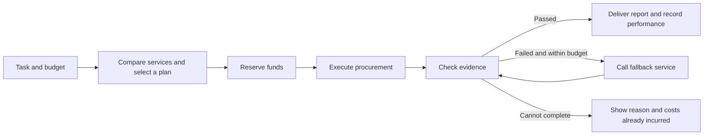

# AgentCo Product Brief: Initial Proposal and Current Implementation

[English](product-brief.md) | [简体中文](product-brief.zh-CN.md)

Initial proposal compiled on 2026-09-20. This document preserves the product direction and hackathon research as background. “Current implementation” below describes this delivery; sections involving live platforms describe future plans.

## Current implementation

This repository now contains a local React + TypeScript + Vite demo with task input, three procurement policies, service comparison, budget allocation, an execution timeline, evidence reports, failure and fallback flows, timeout reconciliation, step-by-step playback, a service directory, local history, spending summaries, and JSON export.

The user explicitly requested **no paid operations; simulate paid data and APIs where necessary**. This delivery therefore uses an entirely local, deterministic engine. It does not connect a wallet, sign anything, call paid services, or transfer real funds. Scout, Sentinel, Atlas, and Lens are fictional services; their prices, seed histories, analyses, and payment records are all synthetic. Entering a real token address does not retrieve real market information.

The browser retains the latest 30 runs. Simulated acceptance results contribute to provider performance in subsequent plans. Selection uses price, deadlines, and a conservative reliability score that accounts for sample size; market star ratings are shown separately. Live OKX AI integration is a future direction, not a completion requirement for this demo. See the [README](../README.md) for setup and the [demo walkthrough](demo-walkthrough.md) for a presentation script.

## What the product does

AgentCo is a workspace that procures AI services on a user's behalf. The user specifies a concrete task, a maximum procurement budget, and quality requirements. AgentCo compares available services, allocates spending, makes calls, checks results, and explains each decision.

Think of it as the purchasing manager, finance team, and quality inspector of a small company: purchasing chooses suppliers, finance controls spending, and quality inspection checks whether the delivery meets the requirements. As services are used, AgentCo can use its own measured records to judge which providers suit which tasks.

The initial users are individuals, developers, or other agents that need onchain research. The product helps them see the basis for procurement decisions, the actual spending, and the evidence behind the delivery together.

The AgentCo MVP discussion shared by the user is the product input for this iteration. The separate “copied text” mentioned in the user's message was not attached and has not been incorporated.

## Event information (initial research record)

- When this information was first compiled, the event page showed registration as closed. The online build period was September 17–25, with an in-person final on October 7. Whether the team has been accepted remains unconfirmed. [Event page](https://luma.com/l4aq8vii)
- The recommended main track is **Build a Company**. That track requires publishing or integrating a working service through OKX AI and demonstrating the complete flow, with the relevant service or integration link included in the submission.
- The deadline recorded at the time was **2026-09-25 23:59 UTC**, equivalent to **2026-09-26 07:59** in Singapore and Beijing. Submission materials include a project description, a repository accessible to judges, a 2–4 minute demo video, and a working product link. A complete hackathon submission and the current fully simulated demo have different scopes; the official integration requirements should be checked separately before a future submission. [Builder Kit](https://www.okx.com/en-sg/learn/okx-dev-day-builder-kit)

## One scenario for the first version

**Verified Token Risk Snapshot: a token risk snapshot supported by evidence.**

The user chooses a chain and token address, then supplies a procurement budget, delivery deadline, and policy. AgentCo selects suitable risk analysis services from a small directory, checks key facts against reference data, and delivers a concise report. Both the current directory and its reference data are simulated; separate demo sources do not establish real-world data independence.

The report has a defined verification scope: checkable information such as token identity, required fields, data timestamps, liquidity, and holder concentration. Passing these checks does not prove that a token is safe and does not constitute a comprehensive audit. The interface should show, item by item, what has been verified and where evidence is missing.

Fallback calls have an explicit limit: at most one in the first version, with no unlimited retry loop.

## How a procurement works

The following describes the current engine's demo behavior with the initial seed history, not market prices. All amounts are recorded as integer cents and displayed in USDT; there are no actual payments or network fees. All applicable fees would need to be verified separately for a future live integration.

The user sets a **0.50 USDT procurement budget and a 45-second delivery deadline**, then chooses Balanced:

1. AgentCo compares three services with the required capabilities and selects a plan using price, observed performance, sample size, and the deadline.
2. The primary Sentinel service costs 0.20 and Lens verification costs 0.02. The Atlas fallback costs 0.14, with another 0.02 to verify its result.
3. The worst permitted path costs 0.38, so 0.38 is reserved before execution, leaving 0.12 unallocated.
4. The primary service and verification succeed, with spending of 0.22.
5. The unused 0.16 reservation is released, leaving 0.28 of the budget unspent. Releasing a budget reservation is not an onchain refund.
6. The report explains why the service was selected, which evidence passed verification, and how much was spent, while recording the run's performance.

The budget must constrain the worst permitted path. Expected cost can help compare plans, but it cannot replace checking the spending ceiling.

If verification finds a disagreement, the primary result is rejected. At most one fallback analysis is purchased and verified again, bringing total simulated spending to 0.38. `Response timeout` instead demonstrates a response lost after payment was recorded: the system reconciles and recovers the same invocation, reusing the original record to avoid a second payment. If no fallback is available, it shows the failure reason and simulated costs already incurred.

## Three policies

| Policy | User priority | Current demo selection approach |
| --- | --- | --- |
| Lowest cost | Minimize spending | Control cost among services that meet minimum capability and delivery requirements; show the reduced verification coverage |
| Balanced | Balance cost and evidence | Combine a primary service with independent verification, reserving a fallback when the budget permits |
| High assurance | Prioritize agreement between sources | Purchase multiple opinions and cross-check them where possible; explicitly show when the budget cannot support execution |

With the initial history, a 0.50 USDT budget, and a 45-second deadline, Lowest cost uses Scout and spends 0.06. Balanced uses Sentinel + Lens, spending 0.22 on success or 0.38 on the fallback path. High assurance uses Sentinel + Atlas + Lens, spending 0.36 on success or 0.44 on the fallback path. Lower budgets or shorter deadlines change the service combination and fallback scope; accumulating local history also affects future choices. The estimated time ceiling includes the permitted fallback path and a 2-second reconciliation allowance.

A higher policy level does not guarantee a correct result. It means broader verification coverage and stricter execution conditions.

Selection should be calculated using explainable program rules. A language model may help interpret input and organize reports; amounts, budgets, candidate filtering, and execution permissions are controlled by explicit logic.

## Responsibilities of AgentCo and OKX (future integration plan)

This section preserves the initial architecture proposal. None of the OKX, A2MCP, x402, or Agentic Wallet capabilities below are integrated into the current demo, and none are triggered during a demonstration.

| Component | Responsibility |
| --- | --- |
| AgentCo | Service filtering, budget planning, policy explanations, acceptance checks, fallback flows, measured performance records, and the interface |
| OKX AI | A future live service marketplace and service identities; the service directory would need verification at that stage |
| A2MCP / x402 | Standardized per-call service invocation and payment flows |
| Agentic Wallet | Payment signing and wallet capabilities for live calls |
| Independent data sources | Comparable evidence for specific facts in a report |

The [A2MCP documentation](https://web3.okx.com/onchainos/dev-docs/okxai/howtomcp) describes free endpoints and x402 pay-per-call endpoints. The [Agentic Wallet documentation](https://web3.okx.com/onchainos/dev-docs/home/agentic-wallet-overview) describes x402 payment support. Specific endpoints, currencies, networks, and fees must be verified when integration is undertaken.

In the future, AgentCo itself could be packaged as a paid A2A service that delivers reports to customers while purchasing downstream services to complete their tasks. Under the [current A2A flow](https://web3.okx.com/onchainos/dev-docs/okxai/a2a-no-subscription), customer funds are escrowed first and settled after delivery is accepted. This implies that downstream procurement needs AgentCo's own working capital; unreleased customer escrow cannot be treated as spendable funds. Customer pricing, procurement budgets, wallet balances, and profit should be accounted for separately.

This A2A extension comes after the procurement flow is complete. The existing OKX AI task escrow flow should not be confused with the [general Escrow Payment interface still marked as under development](https://web3.okx.com/onchainos/dev-docs/payments/core-concept).

## Checks and corrections to the shared proposal (initial research record)

- [PULSE / Agent 8355](https://okx.ai/agents/8355): the browser visit during this research returned a page-not-found result. The original service prices, reviews, and availability cannot be treated as current facts; this observation also does not establish that the service has been permanently removed in every region.
- [Onchain Data Explorer / Agent 2023](https://okx.ai/agents/2023): it was accessible during this research, and its page showed a free chain directory and several data services priced at 0.01 USDT per call. Specific risk verification endpoints, chain support, response fields, and data independence still require testing; viewing the page does not mean integration has succeeded.
- The other candidate services in the shared discussion have not all been verified individually. The service directory should retain the verification time, capabilities, real service ID, and source.
- Market ratings and sales counts are reference signals only. AgentCo's task acceptance rates, latency, and failure records come from its own call observations, with sample sizes displayed. Sales counts must not be treated as successful task counts, and simulated history must not be presented as real performance.
- If two services depend on the same underlying data source, that relationship should be shown; they must not be described as two fully independent pieces of evidence.

## This demo's delivery scope and future work

This delivery is a complete local visual and interactive demo: task input, three policies, service comparison, budget changes, execution progress, evidence reports, explainable failures, timeout reconciliation, and reset/replay. It uses deterministic demo data and state progression; the interface, events, and exported files identify their simulated origins.

If live integration is pursued in the future, OKX AI services, the scope of the budget, and the wallet environment should be verified separately, with real invocation and payment evidence established. The current task neither authorizes nor requires that step. Live, recorded, and simulated sources should then be labeled separately; only simulated sources are implemented now.

The current directory is fixed at three fictional analysis services and one fictional verification service. General task decomposition, marketplace-wide search, custom payment escrow, and a complex multitenant backend are deferred.

Available real providers, endpoints and chain support, and the team's participation status remain items to confirm for future integration or hackathon preparation. They do not affect delivery of this fully simulated demo.

## What the demo needs to demonstrate

- Users can understand why AgentCo selected a service.
- Switching procurement policies for the same task changes the plan and costs in explainable ways.
- Spending plus the remaining reservation never exceeds the limit; an insufficient budget prevents paid calls.
- Failed verification is shown clearly, and fallback calls must respect both the budget and the attempt limit.
- An uncertain payment state triggers reconciliation of the original invocation before any repeat payment.
- The final report can be traced back to the services, result sources, costs, and acceptance records.

Product input: [the AgentCo MVP discussion shared by the user](https://chatgpt.com/share/6aae7f96-13bc-83ec-b2a3-2a317c76cae7). Its suggestions have been narrowed using the research and visual demo goals for this iteration; they have not been treated as guarantees of platform capability.
